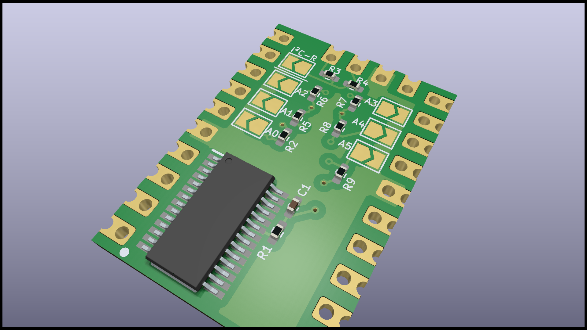

# I²C IO-Expander

Core goal is a pcb with the same pin outs, but with different i²C IO Expander. Castellated holes with secondary pin header holes are added, for direct PCB soldering. Secondary pin header holes are placed in a matrix of 2,54 mm (100 mils). Because of the fixed pin layout of the pcb, I created the boards in a four layer design.

# Versions

## SX1509

## PCA9685

## Features

* Solder pads for I²C address
* Solder pads for I²C Pull-Up Resistor

## ToDos

* Create working GitHub workflow to create releases
* Optimize GitHub workflow for a more generic solution (no modification, when adding a new board)
